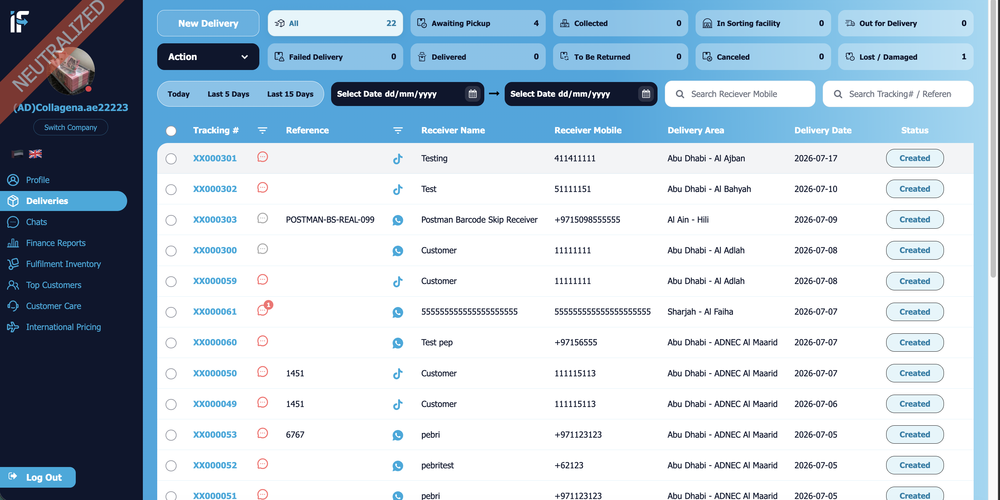

## Project Description
**iFast Express** is a logistics service based in Dubai, moving deliveries across the UAE. The whole operation runs on **Odoo**: every delivery moves through a live pipeline — awaiting pickup, collected, in sorting facility, out for delivery, delivered — with returns, cancellations, and lost/damaged handling tracked in the same flow. Around that core sit finance reports, fulfilment inventory, international pricing, and customer care, with multi-company support and a bilingual English/Arabic interface.

The public site at ifast.express fronts the platform — company profile, shipment tracking, and the download door to the customer apps.

## What I did
- Built the delivery operations platform on Odoo — the delivery lifecycle pipeline, finance reports, fulfilment inventory, and international pricing
- Developed the dynamic frontend views with OWL JS
- Developed the public website with shipment tracking
